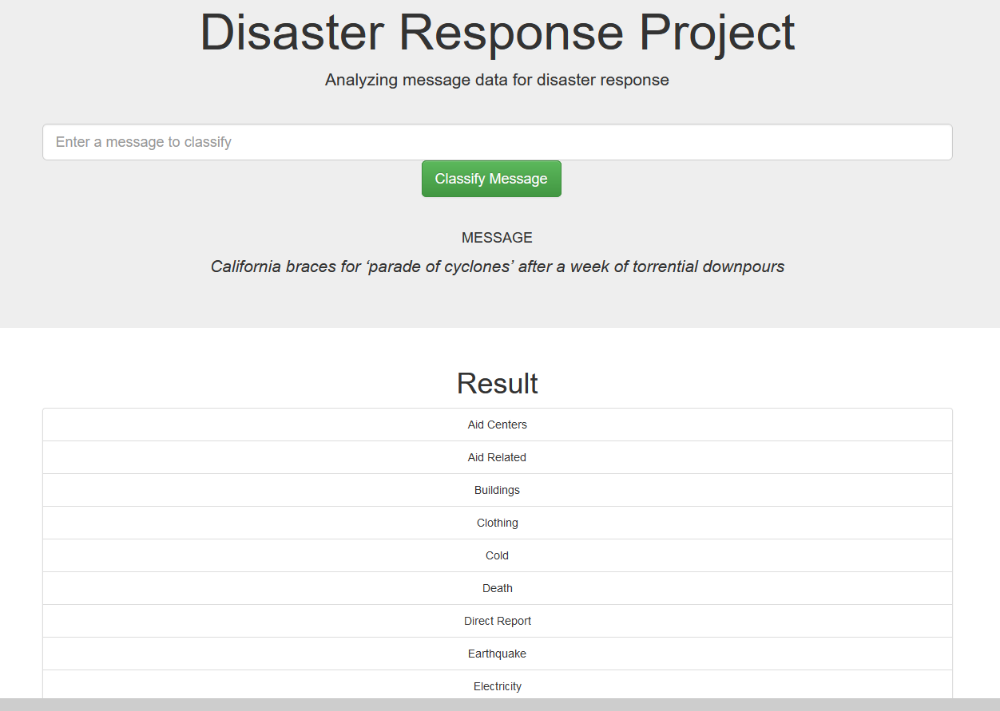
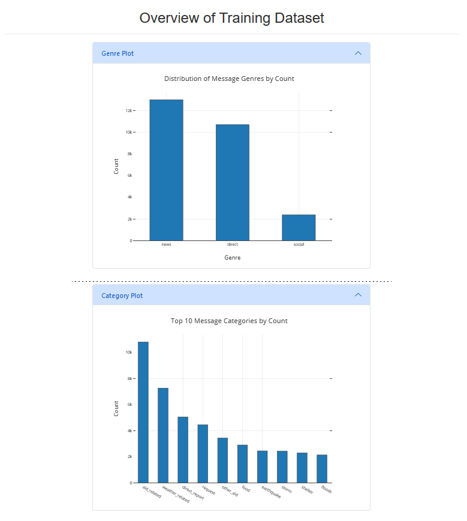
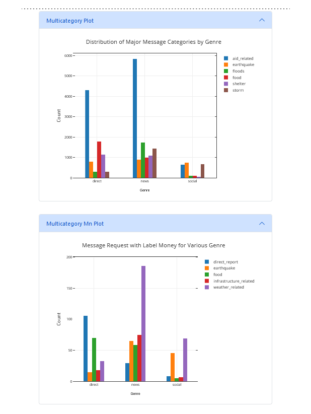

# Disaster Response Pipeline Project

### Instructions:
1. Run the following commands in the project's root directory to set up your database and model.

    - To run ETL pipeline that cleans data and stores in database
        `python data/process_data.py data/disaster_messages.csv data/disaster_categories.csv data/DisasterResponse.db`
    - To run ML pipeline that trains classifier and saves
        `python models/train_classifier.py data/DisasterResponse.db models/classifier.pkl`

2. Go to `app` directory: `cd app`

3. Run your web app: `python run.py`

4. Click the `PREVIEW` button to open the homepage

5. The homepage shows `master.html` file, which is made of two parts

<figure>

<figcaption align = "center"><b>Fig 1. master.html: classify message</b></figcaption>
</figure>
 
<figure>

<figcaption align = "center"><b>Fig 2. go.html: message category-labels</b></figcaption>
</figure>
 
6. As shown in the above figures, part one is composed of classification of messages, `master.html` has a text input where a message can be entered, and below it there is a button `Classify Message`. Clicking on the button submits a request, and returns a response with the message category-labels.

<figure>

<figcaption align = "center"><b>Fig 3. master.html: simple plots</b></figcaption>
</figure>
 
7. As shown in figures `3` and `4`, part two is composed of plots, there are `simple` and `multicategory` plots. There are two such `simple` plots - each of which contain a sorted representation of a pandas `series`. The other plots are similar sorted representations of grouped data. Because these plots sort after grouping, they are `multicategory` in nature due to the grouped data being used.

<figure>

<figcaption align = "center"><b>Fig 4. master.html: multicategory plots</b></figcaption>
</figure>